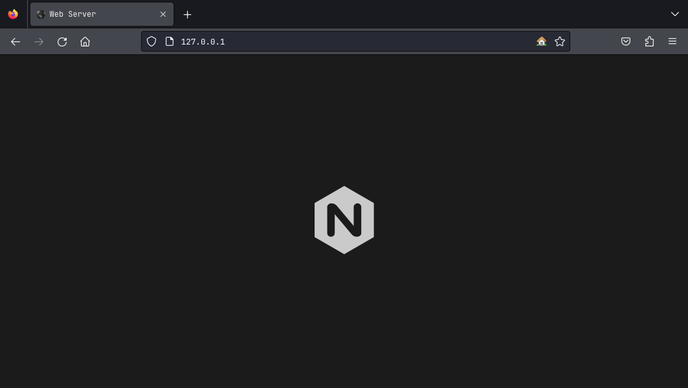
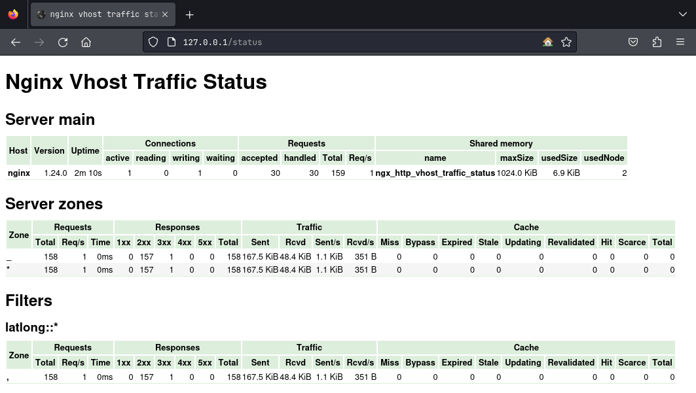
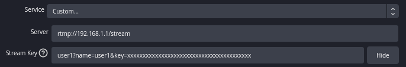
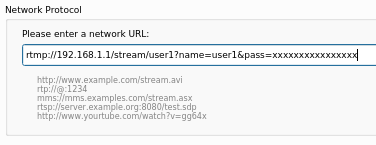

<p align="center"><a href="https://github.com/k44sh/nginx" target="_blank"></a></p>

<p align="center">
  
  <a href="https://gitlab.com/cyberpnkz/nginx/-/pipelines/latest"></a>
  <a href="https://github.com/k44sh/nginx"></a>
  <a href="https://raw.githubusercontent.com/k44sh/nginx/main/LICENSE"></a>
</p>

<p align="center">
  <a href="https://hub.docker.com/r/k44sh/nginx/tags?page=1&ordering=last_updated"></a>
  <a href="https://hub.docker.com/r/k44sh/nginx/tags"></a>
  <a href="https://hub.docker.com/r/k44sh/nginx/tags"></a>
</p>

## About

[NGINX](https://nginx.org/) and [PHP](https://www.php.net/) Docker image based on [Alpine Linux](https://www.alpinelinux.org/).<br/>
___

## Features

* Latest [NGINX](https://nginx.org/download) with latest [PHP 8.3](https://www.php.net/releases/8.1/en.php) from `Alpine` repository
* [GeoIP2](https://www.maxmind.com/en/geoip-databases) database by [MaxMind](https://www.maxmind.com) (Update with your own key)
* [s6-overlay](https://github.com/just-containers/s6-overlay) process supervisor
* Run as non-root user
* Multi-platform image

## Modules

| **Module**                                                                            | **Desctiption**                                               |
| :------------------------------------------------------------------------------------ | :------------------------------------------------------------ |
| [nginx-mod-http-brotli](https://github.com/google/ngx_brotli)                         | Serves compressed responses with brotli (`Google`)            |
| [nginx-mod-http-auth-jwt](https://github.com/kjdev/nginx-auth-jwt)                    | Client authorization (JSON Web Token (JWT) / OpenID Connect)  |
| [nginx-mod-http-cookie-flag](https://github.com/AirisX/nginx_cookie_flag_module)      | Set the flags `HttpOnly`, `secure and` `SameSite` for cookies |
| [nginx-mod-http-dav-ext](https://github.com/arut/nginx-dav-ext-module)                | Additional implementation for full WebDav compatibility       |
| [nginx-mod-http-fancyindex](https://github.com/aperezdc/ngx-fancyindex)               | Like the built-in autoindex module, but fancier               |
| [nginx-mod-http-geoip2](https://github.com/leev/ngx_http_geoip2_module)               | City and country code lookups via the MaxMind GeoIP2          |
| [nginx-mod-http-headers-more](https://github.com/openresty/headers-more-nginx-module) | Set and clear input and output headers                        |
| [nginx-mod-http-vts](https://github.com/vozlt/nginx-module-vts)                       | Virtual host and upstream traffic status                      |
| [nginx-mod-rtmp](https://github.com/arut/nginx-rtmp-module)                           | RTMP protocol support. Live streaming and video on demand     |

### Example

#### VTS Module

<p align="center">
  <a href="https://gitlab.com/cyberpnkz/nginx" target="_blank"></a>
</p>

## Supported platforms

* linux/amd64
* linux/arm64
* linux/arm/v7

## Usage

### Docker Compose

Docker compose is the recommended way to run this image.

Edit the compose file with your preferences and run the following command:

```shell
git clone https://github.com/k44sh/nginx.git
mkdir -p {config,data}
docker-compose up -d
docker-compose logs -f
```

### Upgrade

To upgrade, pull the newer image and launch the container:

```shell
docker-compose pull
docker-compose up -d
```

### Command line

You can also use the following minimal command:

```shell
docker run --rm -d --name nginx \
  -p 80:8080/tcp \
  -p 1935:1935 \
  -e TZ="America/Toronto" \
  k44sh/nginx && \
  docker logs -f nginx
```

Or this one for more customization:

```shell
docker run --rm -d --name nginx \
  --ulimit nproc=65535 \
  --ulimit nofile=32000:40000 \
  --memory=2g \
  --cpus=4 \
  -p 80:8000/tcp \
  -p 1935:1935 \
  -e TZ="America/Toronto" \
  -e PORT="8000" \
  -e PUID="1002" \
  -e PGID="1002" \
  -e USER="docker" \
  -e MM_ACCOUNT="XXXXXX" \
  -e MM_LICENSE="xxxxxxxxxxxx" \
  -e MEMORY_LIMIT="1024M" \
  -e UPLOAD_MAX_SIZE="100M" \
  k44sh/nginx && \
  docker logs -f nginx
```

## Environment Variables

| **Variable**       | **Description**                                                                  |
| :----------------- | :------------------------------------------------------------------------------- |
| `TZ`               | The timezone assigned to the container (default `UTC`)                           |
| `PORT`             | NGINX listening port (default `8080`)                                            |
| `PUID`             | NGINX user id (default `1000`)                                                   |
| `PGID`             | NGINX group id (default `1000`)                                                  |
| `USER`             | The user name assigned to the container (default `docker`)                       |
| `GEOIP2_CONF`      | Path to GeoIP2 configuration file (default `/etc/geoip2.conf`)                   |
| `GEOIP2_PATH`      | Path to the GeoIP2 data directory (default `/geoip2`)                            |
| `MM_ACCOUNT`       | **Your** MaxMind account ID                                                      |
| `MM_LICENSE`       | **Your** MaxMind license key                                                     |
| `MEMORY_LIMIT`     | PHP memory limit (default `512M`)                                                |
| `UPLOAD_MAX_SIZE`  | Upload max size (default `16M`)                                                  |
| `CLEAR_ENV`        | Clear environment in FPM workers (default `yes`)                                 |
| `OPCACHE_MEM_SIZE` | PHP OpCache memory consumption (default `256`)                                   |
| `MAX_FILE_UPLOADS` | The maximum number of files allowed to be uploaded simultaneously (default `50`) |

### RTMP (Streaming)

* `/var/www/stream/play.php`: Internal authentication to add an authentication when publishing a stream
* `/var/www/stream/publish.php`: Internal authentication to add authentication to watch a stream

```php
// Accounts
$accounts  =  array(
  0  =>  array(
    "name"  =>  "user1",
    "pass"  =>  "xxxxxxxxxxxxxxxx"
  ),
[...]
```

You can configure OBS like this:

* Server Example: `rtmp://192.168.1.1/stream`
* Key Example: `user1?name=user1&key=xxxxxxxxxxxxxxxxxxxxxxxxxxxxxxxxxxxxxxxx`

<p align="center">
  <a href="https://gitlab.com/cyberpnkz/nginx" target="_blank"></a>
</p>

You can watch a stream like this:

* Network URL: `rtmp://192.168.1.1/stream/user1?name=user1&pass=xxxxxxxxxxxxxxxx`

<p align="center">
  <a href="https://gitlab.com/cyberpnkz/nginx" target="_blank"></a>
</p>

If you want remove authentication, just comment the following directives in `nginx.conf`:

* `on_publish` http://127.0.0.1:8080/stream/publish.php;
* `on_play` http://127.0.0.1:8080/stream/play.php;

Documentation: [https://github.com/arut/nginx-rtmp-module/wiki/Directives](https://github.com/arut/nginx-rtmp-module/wiki/Directives)